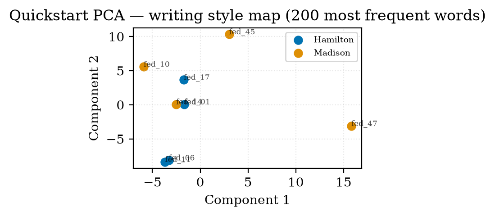

<p align="center">
  
</p>

<p align="center">
  <a href="https://pypi.org/project/bitig/"></a>
  <a href="pyproject.toml"></a>
  <a href="https://github.com/fatihbozdag/bitig/actions/workflows/ci.yml"></a>
  <a href="https://fatihbozdag.github.io/bitig/"></a>
  
  <a href="LICENSE"></a>
</p>

---

`bitig` is a Python package and command-line tool for **authorship attribution**,
**author-group style comparison** and **forensic authorship analysis**. It covers the core
methods of R's `Stylo` (Delta, Zeta, PCA/MDS, clustering, bootstrap consensus trees,
classification) and adds a spaCy pipeline, transformer embeddings, a Bayesian layer (PyMC),
authorship verification with likelihood-ratio calibration, and a case workflow with
chain-of-custody hashing and sealed reports.

The name is the Old Turkic word for *writing* or *inscription*, the kind cut into the
8th-century Orkhon stelae.

<p align="center">
  
</p>

## Install

```bash
pip install bitig            # or: uv pip install bitig
```

`bitig run` works on raw text. The spaCy model is only needed for `bitig ingest` and the
parse-based features (POS n-grams, dependency bigrams):

```bash
python -m spacy download en_core_web_trf
```

Optional extras:

| Extra | Adds |
|---|---|
| `bitig[cluster]` | UMAP and HDBSCAN |
| `bitig[bayesian]` | PyMC + arviz (Wallace–Mosteller, hierarchical group comparison) |
| `bitig[embeddings]` | sentence-transformers and contextual BERT embeddings |
| `bitig[viz]` | plotly, kaleido, ete3 |
| `bitig[interactive]` | plotly only, for interactive figures |
| `bitig[reports]` | WeasyPrint for PDF export |
| `bitig[gui]` | NiceGUI + pywebview for `bitig gui` |
| `bitig[turkish]` | spacy-stanza + Stanza for Turkish parsing (`bitig[multilang]` is an alias) |
| `bitig[docs]` | MkDocs Material, to build the documentation site |

English readability needs the CMU pronouncing dictionary, which bitig never downloads on its
own: `python -m nltk.downloader cmudict`.

## Quickstart

```bash
bitig init my-study                # scaffold corpus/, results/ and a study.yaml
cd my-study
# 1. put .txt files in corpus/
# 2. add corpus/metadata.tsv (tab-separated: filename, author, ...)
# 3. in study.yaml, uncomment the `metadata: corpus/metadata.tsv` line
bitig run study.yaml --name demo   # Burrows Delta on the 1000 most frequent words
bitig report results/demo --output results/demo/report.html
```

Each method writes a `result.json` with its provenance (corpus hash, feature hash, seed,
library versions, resolved config) plus its figures. `bitig run` exits with code 1 if any
method failed and refuses to overwrite an earlier run unless you pass `--overwrite`.

The same in Python:

```python
import numpy as np
from bitig import BurrowsDelta, MFWExtractor, load_corpus

corpus = load_corpus("corpus", metadata="corpus/metadata.tsv")
fm = MFWExtractor(n=200, scale="zscore", lowercase=True).fit_transform(corpus)

authors = np.array(corpus.metadata_column("author"))
known = authors != "Unknown"
delta = BurrowsDelta().fit(fm.X[known], authors[known])
print(delta.predict(fm.X[~known]))
```

Two worked examples ship with the repository:

- [`examples/quickstart/`](examples/quickstart/): nine Federalist Papers, step by step,
  attributing the disputed No. 50.
- [`examples/federalist/`](examples/federalist/): all 85 papers, following Mosteller &
  Wallace (1964). The texts are essay bodies only; headers and author bylines are stripped.

## What's included

| Layer | Contents |
|---|---|
| **Corpus** | `.txt` + TSV metadata, filtering and grouping, a corpus hash that binds each text to its id and metadata |
| **Features** | most frequent words, character / word / POS n-grams, dependency bigrams, function words, punctuation, sentence length, readability (6 English indices plus native Turkish, German, Spanish and French formulas), 8 lexical-diversity indices, sentence and contextual embeddings |
| **Methods** | Burrows, Eder, Eder Simple, Argamon, Cosine and Quadratic Delta; Zeta (classic, Eder); PCA, MDS, t-SNE, UMAP; Ward, k-means, HDBSCAN; bootstrap consensus trees; sklearn classifiers with stylometry-aware cross-validation (stratified, leave-one-author-out, leave-one-text-out); Bayesian Wallace–Mosteller and hierarchical group comparison |
| **Forensic** | General Impostors and Unmasking verification; Sapkota character n-gram categories and Stamatatos text distortion for topic robustness; Platt / isotonic calibration to log-LRs; C_llr, AUC, c@1, F0.5u (PAN definitions), ECE, Brier, Tippett data; LR-framed HTML report with the two-sided verbal scale of Nordgaard et al. (2012), as adopted by ENFSI (2015) |
| **Languages** | English, Turkish, German, Spanish, French: per-language function words, readability and embedding defaults; Turkish parsing through Stanza (BOUN treebank) |
| **Output** | `result.json` + Parquet tables + figures per method; HTML / Markdown reports; PDF export of case reports (`bitig[reports]`) |

## Forensic toolkit

```python
from bitig.forensic import (
    GeneralImpostors, Unmasking,       # authorship verification
    CategorizedCharNgramExtractor,     # Sapkota et al. (2015) n-gram categories
    distort_corpus,                    # Stamatatos (2017) text distortion
    CalibratedScorer,                  # scores → calibrated log-LRs
    compute_pan_report,                # PAN-style evaluation
)
```

A verification score is not a likelihood ratio. `CalibratedScorer` turns scores into log-LRs
using a calibration set of same-author and different-author trials; isotonic calibration
needs at least 20 trials per class and caps |log₁₀ LR| at log₁₀ of the calibration-set size.
Report the LR of the case you are asked about, not an average over trials. The
[forensic docs](https://fatihbozdag.github.io/bitig/forensic/) and the
[PAN-CLEF tutorial](https://fatihbozdag.github.io/bitig/tutorials/pan-clef/) go through the
full pipeline.

## Forensic Lab: cases

`bitig case` keeps one directory per investigation: registered evidence with SHA-256
custody hashes, a recipe-driven analysis, an HTML report and a seal.

```bash
bitig case new letter-2026 --title "Disputed letter" --examiner "A. Examiner" --recipe imposters_lr
bitig case add-evidence letter-2026 questioned.txt --role questioned
bitig case add-evidence letter-2026 known_a1.txt known_a2.txt --role known --author A
bitig case add-evidence letter-2026 known_b1.txt known_b2.txt --role known --author B
python -c "from bitig.cases import Case; Case.load('$HOME/.bitig/cases/letter-2026').set_param('methods[verify].candidate', 'A')"
bitig case run letter-2026       # refuses if any evidence file changed since registration
bitig case sign letter-2026      # renders the report and seals the case (read-only afterwards)
bitig case verify letter-2026    # re-checks custody, report, run outputs and the seal
```

`bitig case verify` exits with 0 for a verified HMAC seal, 1 if the case is not signed,
2 if any check fails, 3 for an intact Null seal and 4 for an HMAC seal checked without its
key. The default (Null) seal is an integrity record only: anyone with write access can
recompute it. Sign with `--signature-plugin hmac` and a key in `BITIG_SIGNATURE_KEY` for a
tamper-evident seal. Changed evidence must be re-acknowledged with a reason, which goes into
a sealed custody log, and a signed case can only be forked. Case parameters (here the
candidate author for General Impostors) are set in the GUI's Method step or with
`Case.set_param`; there is no CLI command for them yet. See the
[Forensic Lab page](https://fatihbozdag.github.io/bitig/forensic/case-workflow/).

## Desktop GUI

```bash
pip install "bitig[gui]"
bitig gui              # native window; --no-native opens a browser tab instead
```

The GUI has two parts. The study pages (**Ingest → Study → Run → Results**, plus
**Forensic**) build and run a `study.yaml`. The **Forensic Lab** walks a case through
Evidence, Method, Run, Findings and Report. The GUI can seal a case only with the Null
plugin; use the CLI for HMAC seals.

<p align="center">
  
</p>
<p align="center"><sub>PCA of the eight training papers in the quickstart. With this few essays the two authors do not separate cleanly; the attribution of No. 50 comes from Burrows Delta.</sub></p>

## Documentation

**<https://fatihbozdag.github.io/bitig/>**, in English and Turkish.

- [Getting started](https://fatihbozdag.github.io/bitig/getting-started/)
- [Concepts](https://fatihbozdag.github.io/bitig/concepts/): corpus, features, languages, methods, results and provenance
- [Forensic toolkit](https://fatihbozdag.github.io/bitig/forensic/): verification, calibration, topic invariance, PAN evaluation, reporting, the case workflow
- Tutorials: [Federalist Papers](https://fatihbozdag.github.io/bitig/tutorials/federalist/), [PAN-CLEF verification](https://fatihbozdag.github.io/bitig/tutorials/pan-clef/), [Turkish stylometry](https://fatihbozdag.github.io/bitig/tutorials/turkish/)
- [Reference](https://fatihbozdag.github.io/bitig/reference/): CLI, `study.yaml` schema, Python API

## Status

The latest release on PyPI is **0.3.1**. `main` carries unreleased changes, several of
which change results or behaviour (case seals, General Impostors defaults, calibration,
PAN metrics, feature scaling). [`CHANGELOG.md`](CHANGELOG.md) lists them, marked
**[results]** and **[breaking]**.

## License and citation

BSD-3-Clause; see [`LICENSE`](LICENSE). If you use bitig in published work, please cite it:
see [`CITATION.cff`](CITATION.cff).

## References

- Burrows, J. (2002). 'Delta': a measure of stylistic difference and a guide to likely
  authorship. *Literary and Linguistic Computing*, 17(3), 267–287.
- Mosteller, F., & Wallace, D. L. (1964). *Inference and Disputed Authorship: The Federalist*.
  Addison-Wesley.
- Koppel, M., & Schler, J. (2004). Authorship verification as a one-class classification
  problem. *Proceedings of ICML 2004*, 489–495.
- Koppel, M., & Winter, Y. (2014). Determining if two documents are written by the same
  author. *JASIST*, 65(1), 178–187.
- Sapkota, U., Bethard, S., Montes-y-Gómez, M., & Solorio, T. (2015). Not all character
  n-grams are created equal. *Proceedings of NAACL-HLT 2015*, 93–102.
- Stamatatos, E. (2017). Authorship attribution using text distortion. *Proceedings of
  EACL 2017*, 1138–1149.
- Platt, J. C. (1999). Probabilistic outputs for SVMs and comparisons to regularized
  likelihood methods. *Advances in Large Margin Classifiers*, 61–74.
- Brümmer, N., & du Preez, J. (2006). Application-independent evaluation of speaker
  detection. *Computer Speech & Language*, 20(2–3), 230–275.
- Peñas, A., & Rodrigo, A. (2011). A simple measure to assess non-response. *Proceedings of
  ACL-HLT 2011*, 1415–1424.
- Vergeer, P., van Es, A., de Jongh, A., Alberink, I., & Stoel, R. (2016). Numerical
  likelihood ratios outputted by LR systems are often based on extrapolation: when to stop
  extrapolating? *Science & Justice*, 56(6), 482–491.
- Nordgaard, A., Ansell, R., Drotz, W., & Jaeger, L. (2012). Scale of conclusions for the
  value of evidence. *Law, Probability and Risk*, 11(1), 1–24.
- ENFSI (2015). *Guideline for evaluative reporting in forensic science*.
