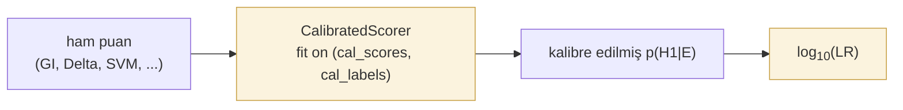

# Kalibrasyon ve LR çıktısı

*Şu durumda kullanın:* doğrulayıcınız ham puanlar (mesafeler, kesirler, olasılıklar) üretiyorsa ve bunların adli rapora geçmeden önce kalibre edilmiş log-olabilirlik oranlarına dönüştürülmesi gerekiyorsa.
*Şu durumda kullanmayın:* puanlayıcınız zaten iyi kalibre edilmiş bir LR üretiyorsa — doğrudan değerlendirme adımına geçin.
*Beklenen sonuç:* `predict_proba` / `predict_log_lr` çıktıları etiketli bir geliştirme kümesine karşı kalibre edilmiş, uydurulmuş bir kalibratör.

Bir doğrulayıcıdan elde edilen ham puanlar nadiren olduğu gibi güvenilir olasılıklardır. Bu sayfa, iki standart sonradan kalibrasyon yöntemini ve kalibre edilmiş bir sonsal olasılığın log-LR değerine dönüştürülmesini ele almaktadır; delil zinciri alanları ve raporun kendisi [Raporlama](reporting.md) sayfasında açıklanır.

Doğrulama sistemleri ham puanlar üretir. Adli raporlama, mahkemelerin anladığı kanıtsal semantik için **kalibre edilmiş posteriorların** **olabilirlik oranlarına (likelihood ratio)** dönüştürülmesini bekler. `bitig.forensic` her iki adımı da sağlar.

## İş akışı



Kalibrasyon katı, test katından **ayrı** olmalıdır. Kalibratörü test kümesi üzerinde aşırı uydurmak, iyimser C_llr ve ECE değerleri üretir.

## CalibratedScorer

*Şu durumda kullanın:* herhangi bir doğrulayıcıdan (`GeneralImpostors`, `Unmasking`, özel bir Delta sınıflandırıcısı) elde ettiğiniz ham puanlar için kalibre edilmiş olasılıklar ve log-LR değerleri istiyorsanız.
*Şu durumda kullanmayın:* üst akış puanlayıcınız zaten kalibre edilmiş çıktı üretiyorsa.
*Beklenen sonuç:* `fit(scores, y)` eşlemeyi etiketli kalibrasyon denemelerinden öğrenir; `predict_proba(scores)` kalibre edilmiş p(H1 | puan) döndürür; `predict_log_lr(scores)` kanıtsal niceliği döndürür. Sınıf doğrulayıcının kendisi üzerinde değil, puan dizileri üzerinde çalışır.

Platt (lojistik) veya izotonik olmak üzere 1-D monoton bir kalibratör uydurur.

```python
from bitig.forensic import CalibratedScorer

scorer = CalibratedScorer(method="platt").fit(calibration_scores, calibration_labels)
probs   = scorer.predict_proba(test_scores)
log_lrs = scorer.predict_log_lr(test_scores, base=10.0)
```

### Yöntem seçimi

| Yöntem | Ne zaman kullanılır |
|---|---|
| `"platt"` | Küçük kalibrasyon kümeleri (sınıf başına < 100). Parametrik; sigmoid eşleme varsayar. Sağlamdır. |
| `"isotonic"` | Daha büyük kalibrasyon kümeleri (sınıf başına ≥ 100 önerilir; ≥ 20 zorunludur). Parametrik olmayan; esnek. |

Platt kesin monotondur; sıra düzenini ve AUC'yi korur. İzotonik yalnızca azalmayandır: puanları eşit basamaklarda birleştirir ve AUC'yi biraz düşürebilir.

### Platt kalibrasyonu

*Şu durumda kullanın:* puanlayıcınızın karar sınırı log-odds cinsinden yaklaşık doğrusal bir yapıdaysa — lojistik regresyon benzeri bir şekil. İzotonikten daha az parametre gerektirir; daha az etiketli deneme yeterlidir.
*Şu durumda kullanmayın:* puan-olasılık ilişkiniz monoton değilse veya keskin kıvrımlar içeriyorsa — Platt'ın sigmoidi yetersiz kalır.
*Beklenen sonuç:* skaler parametreli sigmoid uyumu; `predict_proba`, `1 / (1 + exp(a*score + b))` aracılığıyla kalibre edilmiş olasılıklar üretir.

### Izotonik kalibrasyon

*Şu durumda kullanın:* puanlayıcınızın karar sınırı doğrusal değilse ve parametrik olmayan bir eğri uydurmak için yeterli etiketli denemeniz varsa (sınıf başına ≥ 100 önerilir).
*Şu durumda kullanmayın:* geliştirme kümeniz küçükse — sınıf başına 20'den az deneme reddedilir.
*Beklenen sonuç:* parçalı sabit kalibrasyon işlevi; `predict_proba` monoton azalmayan adım fonksiyonu üretir.

Güvenlik önlemleri: her sınıf için karşı uca bir sahte deneme eklenir, böylece kalibre edilmiş olasılık hiçbir zaman tam 0 veya 1 olmaz; `n` denemelik bir kalibrasyon kümesi için `|log₁₀ LR|`, `log₁₀(n)` ile sınırlanır (`scorer.log_lr_cap_`) ve sınıra ulaşan çıktılar için `predict_log_lr` uyarı verir. Bu önlemler olmadan küçük, ayrılabilir bir kalibrasyon kümesi log₁₀ LR = ±12 ("son derece güçlü destek") üretiyordu. İzotonik LR'lerin uç değerlerde temkinli olmasını bekleyin.

## Log-LR dönüşümü

Düzleştirilmiş önsel olasılıklar altında ($p(H_1) = p(H_0) = 0{,}5$), log-LR kalibre edilmiş posteriorun logit değeridir:

$$
\log_{10}(\text{LR}) = \log_{10}\left(\frac{p(H_1 \mid E)}{1 - p(H_1 \mid E)}\right)
$$

```python
from bitig.forensic import log_lr_from_probs, log_lr_from_probs_with_priors

log_lrs = log_lr_from_probs(probs)                                # düz önsel olasılıklar
log_lrs = log_lr_from_probs_with_priors(probs, prior_target=0.3)  # düz olmayan
```

`CalibratedScorer.predict_log_lr` bunu sizin için yapar: `fit`, kalibrasyon kümesindeki hedef deneme oranını (`scorer.prior_target_`) kaydeder ve LR bu önsel oranı bölerek çıkarır; böylece LR, her sınıftan kaç deneme ile kalibrasyon yaptığınıza bağlı olmaz. Yukarıdaki iki işlevi doğrudan yalnızca başka bir kaynaktan gelen sonsal olasılıklar için kullanın.

## Sözel ölçek

Log-LR büyüklüklerini altı bantlı Nordgaard et al. (2012) / ENFSI (2015) sözel ölçeği (verbal scale) ile birlikte raporlayın:

| \|log₁₀(LR)\| | Sözel destek |
|---|---|
| 0 – 1 | zayıf |
| 1 – 2 | ılımlı |
| 2 – 3 | ılımlı güçlü |
| 3 – 4 | güçlü |
| 4 – 6 | çok güçlü |
| ≥ 6 | son derece güçlü |

LR > 1 aynı yazar önermesini, LR < 1 farklı yazar önermesini destekler; bir LR ile tersi için destek gücü aynıdır (`bitig.forensic.verbal_scale`).

`build_forensic_report` şablonu, sözel ifadeyi `lr_summaries` ile verilen her LR değerinin yanında oluşturur. Bkz. [Raporlama](reporting.md).

## Referans

::: bitig.forensic.lr.CalibratedScorer
    options:
      show_root_full_path: false

::: bitig.forensic.lr.log_lr_from_probs

::: bitig.forensic.lr.log_lr_from_probs_with_priors
